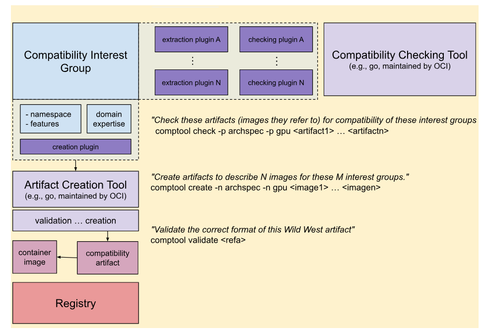

# Comspec in Go


This is a prototype compatibility checking tool. Right now our aim is to use in the context of
[these build matrices](https://github.com/rse-ops/lammps-matrix) for LAMMPS and these prototype [specifications](https://github.com/supercontainers/compspec) that are based off of [Proposal C](https://github.com/opencontainers/wg-image-compatibility/pull/8) of the Compatibility Working Group. This is experimental because all of that is subject (and likely) to change.

## Design

The design is based on the prototype from that pull request, shown below.



Specifically, I'll try to do simple interfaces (in [plugins](plugins)) to:

 - **Extract** Scan a system to collect compatibility metadata / attributes for a named set of extractions
   - this maybe isn't great practice, but if I build the containers I trust them
   - I can also do something simple like run this tool in a pod-> container small cluster
 - load in an artifact spec (json) from a URL
 - compare with a request for a specific system (with any level of detail desired)
   - "basic" might just be providing the architecture
   - "descriptive" might include other variables

The extraction step is also important, but likely this would happen at build time (maybe by another tool).
For now (since this is a prototype) I'm going to just manually do it.

### Limitations

 - I'm starting with just Linux. I know there are those "other" platforms, but if it doesn't run on HPC or Kubernetes easily I'm not super interested (ahem, Mac and Windows)!
 - not all extractors work in containers (e.g., kernel needs to be on the host)

## TODO

 - extract should take a list of extractors, manual for now
 - each extractor should also expose sections to extract (e.g. kernel modules vs cmdline vs config)
 - likely we want a common configuration file to take an extraction -> check recipe
 - need to develop check plugin family
 - todo thinking around manifest.yaml that has listing of images / artifacts

### Extractors wanted / needed

A `*` indicates required for the work / prototype I want to do

 - power usage data [valorium](https://ipo.llnl.gov/sites/default/files/2023-08/Final_variorum-rnd-100-award.pdf)
 - * architecture [archspec](https://github.com/archspec)
 - * MPI existence / variants
 - * operating system stuff
 - ... please add more!

## Usage

Note that there is a [developer environment](.devcontainer) that provides a consistent version of Go, etc.
However, it won't work with all extractors. Build the `compspec` binary with:

```bash
make
```

This generates the `bin/compspec` that you can use:

```bash
./bin/compspec
```
```console
┏┏┓┏┳┓┏┓┏┏┓┏┓┏
┗┗┛┛┗┗┣┛┛┣┛┗ ┗
          ┛  ┛    

Usage:
  comspec version
  comspec extract
```

More usage details will be added soon!

### Version

```bash
$ ./bin/compspec version
```
```console
⭐️ compspec version 0.1.0-draft
```

I know, the star should not be there. Fight me.

### Extract

Right now I've just implemented basic kernel stuffs, and I'm too afraid to use sudo :)

```bash
$ ./bin/compspec extract
```
```console
   module.veth: 6.1.0-1028-oem
   module.i915.parameter.enable_guc: 
   module.snd_hda_intel.parameter.enable: Y,Y,Y,Y,Y,Y,Y,Y,Y,Y,Y,Y,Y,Y,Y,Y,Y,Y,Y,Y,Y,Y,Y,Y,Y,Y,Y,Y,Y,Y,Y,Y
   module.snd_seq.parameter.seq_default_timer_sclass: 0
   module.spurious.parameter.irqfixup: 0
   module.tcp_cubic.parameter.hystart_low_window: 16
   module.btmtk: 0.1
   module.mousedev.parameter.tap_time: 200
   module.printk: 6.1.0-1028-oem
   module.snd_seq_midi.parameter.output_buffer_size: 4096
   module.xt_addrtype: 6.1.0-1028-oem
   module.iwlwifi.parameter.enable_ini: 
   module.kvm_intel.parameter.allow_smaller_maxphyaddr: N
   module.wmi.parameter.debug_event: N
   module.mac80211.parameter.beacon_loss_count: 7
   module.nf_conntrack.parameter.acct: N
   module.nvme.parameter.max_host_mem_size_mb: 128
   module.uv_nmi.parameter.initial_delay: 100
Extraction has run!
```

## Thanks and Previous Art

- I learned about kernel parsing from [mfranczy/compat](https://github.com/mfranczy/compat)

## License

HPCIC DevTools is distributed under the terms of the MIT license.
All new contributions must be made under this license.

See [LICENSE](https://github.com/converged-computing/cloud-select/blob/main/LICENSE),
[COPYRIGHT](https://github.com/converged-computing/cloud-select/blob/main/COPYRIGHT), and
[NOTICE](https://github.com/converged-computing/cloud-select/blob/main/NOTICE) for details.

SPDX-License-Identifier: (MIT)

LLNL-CODE- 842614